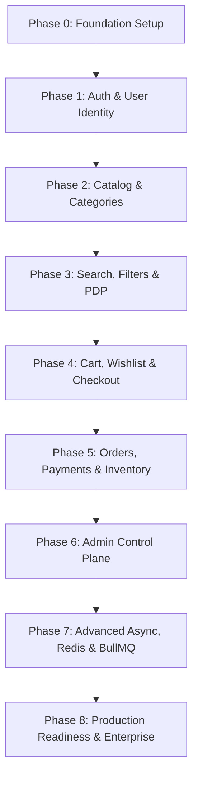

# Feature Roadmap & Phase Progression

## Roadmap Overview
The development lifecycle is divided into 9 sequential, incremental phases. Each phase builds upon the verified foundation of the prior phase.

---

## Phase 0: Project Setup & Baseline Foundation
- Monorepo folder setup (`apps/storefront/`, `apps/admin/`, `packages/shared/`, `server/`, `docs/`, `docker/`).
- Express.js TypeScript scaffolding with strict tsconfig, ESLint, Prettier.
- Centralized environment variable loader (`dotenv` + Zod schema validation).
- MongoDB Mongoose connection with resilient retry logic and graceful shutdown handlers.
- Standardized API response format (`{ success, data, message, error, meta }`).
- Global error-handling middleware and 404 handler.
- Client React + TypeScript + Vite scaffolding with Tailwind CSS and base component library.
- Health-check endpoints (`/api/v1/health`).

---

## Phase 1: Authentication & User Identity
- Mongoose `User` and `Address` schemas with bcrypt password hashing.
- User registration with email uniqueness, strong password validation.
- User login with JWT access token (15m expiry) and refresh token (7d expiry) via HttpOnly cookies.
- Silent token refresh flow (`POST /api/v1/auth/refresh`).
- Secure logout (`POST /api/v1/auth/logout`) with token revocation.
- Password reset token lifecycle (hash-based reset token with 1h expiry).
- Role-based authorization middleware (`requireAuth`, `requireRoles(['CUSTOMER', 'ADMIN'])`).
- Frontend Auth state management (Context/Zustand), Protected Route wrappers, and forms (Login, Register).

---

## Phase 2: Catalog Management (Categories, Brands, Products)
- `Category` and `Brand` schemas with slug generation and hierarchical nesting.
- `Product` and `ProductVariant` models with attributes, images, prices, and SKUs.
- Layered backend implementation: `CategoryModule` & `ProductModule` (Routes, Controllers, Services, Repositories).
- File upload pipeline (Multer + local storage abstraction with easy cloud migration hook).
- Admin endpoints for Category/Product creation, updates, and soft deletes.
- Public read endpoints for category trees and active published products.

---

## Phase 3: Discovery, Search, Filtering & Product Details
- Search endpoint querying text indexes (`name`, `description`, `brand`, `tags`).
- Query builder service for multi-facet filtering (Category, Brand, Price Min/Max, Rating, Stock).
- Sorting service (`price_asc`, `price_desc`, `newest`, `popular`).
- High-performance pagination with cursor/offset metadata.
- Product Details Page (PDP) frontend:
  - Interactive image gallery with zoom.
  - Variant switcher (Size, Color) updating active SKU and inventory badge.
  - Breadcrumbs and related items carousel.

---

## Phase 4: Shopping Cart, Wishlist & Checkout Scaffolding
- `Cart` model supporting session/guest items and authenticated persistence.
- Cart operations: Add, Update Quantity, Remove, Clear.
- Real-time stock verification against active inventory during cart mutations.
- Server-side price calculation (never trusting client totals).
- `Wishlist` CRUD with quick "Move to Cart" feature.
- Multi-step Checkout frontend workflow:
  - Shipping address selection/creation.
  - Shipping rate selector.
  - Order summary breakdown.

---

## Phase 5: Orders, Payments & Stock Management (Core Commerce Loop)
- Mongoose Transaction-protected Checkout:
  - Atomic stock reservation.
  - Order snapshot generation (capturing frozen item prices, variant attributes, and delivery address).
- Order State Machine:
  - `PENDING` ➔ `CONFIRMED` ➔ `PROCESSING` ➔ `PACKED` ➔ `SHIPPED` ➔ `DELIVERED` ➔ `CANCELLED`.
- Payment Module:
  - Cash on Delivery (COD) workflow.
  - Gateway integration (Stripe / Razorpay webhooks for payment verification).
- Automatic inventory decrement upon payment confirmation.
- Order history, tracking, and cancellation window logic for customers.

---

## Phase 6: Admin Control Plane & Promotions
- Admin Dashboard with aggregated analytics (Total GMV, Orders, Active Users, Low Stock).
- Comprehensive Product & Inventory management tables with inline quick actions.
- Order fulfillment interface (Change status, add tracking numbers, cancel/refund).
- Coupon management engine (Percentage / Fixed discount, validity windows, max caps).
- Review moderation queue (Approve / Reject reviews).

---

## Phase 7: Advanced Async Services (Post-MVP)
- Redis integration for product listing caching and session caching.
- BullMQ queue workers for asynchronous tasks:
  - Transactional order confirmation emails.
  - Low-stock inventory alert emails to store admins.
  - Daily sales metrics aggregation.
- WebSocket integration for real-time order status tracking and live admin notifications.

---

## Phase 8: Production Hardening & Enterprise Scale
- Security auditing: Rate limiting, Helmet security headers, NoSQL injection sanitization.
- Comprehensive Automated Testing:
  - Backend Unit & Integration tests (Vitest + Supertest).
  - Frontend Component & Flow tests (React Testing Library).
  - End-to-End browser smoke testing (Playwright).
- Docker multi-stage containerization (`web.Dockerfile`, `server.Dockerfile`, `docker-compose.yml`).
- CI/CD workflow automation (Lint, Typecheck, Test, Build).
