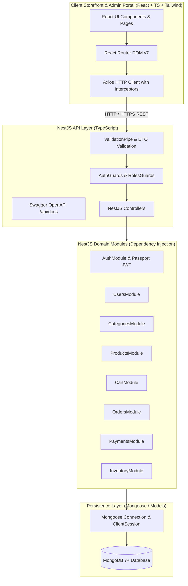
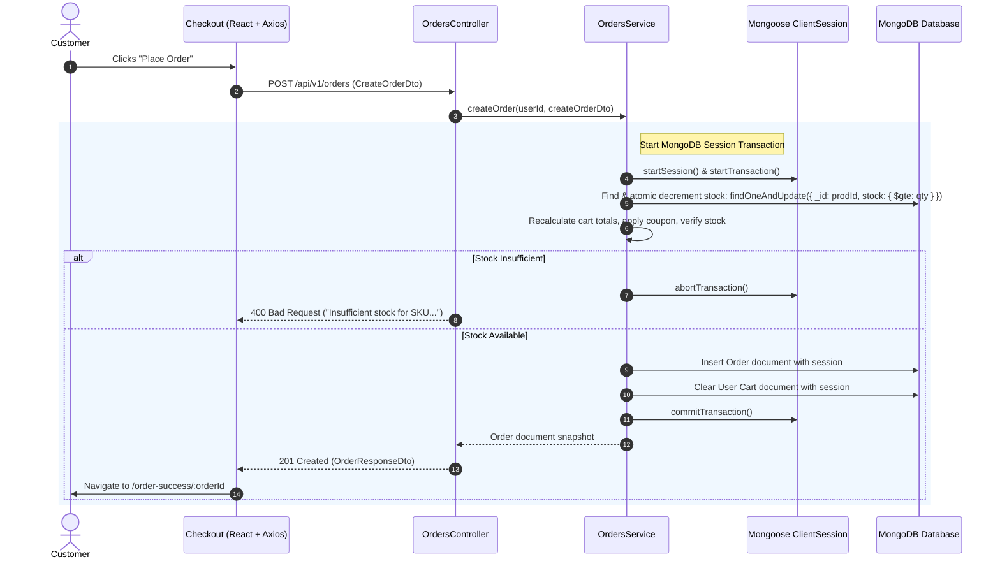

# System Architecture & Design Patterns

## 1. High-Level Architecture Overview

ZYLO is designed as a structured **Modular Monolith** using **NestJS** and **MongoDB**. NestJS provides native dependency injection, decorators, pipes, guards, interceptors, and Swagger integration, while MongoDB with Mongoose provides flexible document modeling, high-throughput writes, indexing, and multi-document ACID transactions via replica sets/sessions.



---

## 2. NestJS Architecture Standards & Component Isolation

Every domain in `server/src/modules/` is encapsulated in a dedicated NestJS Module:

```
Request ──► [Guard] ──► [Pipe / DTO] ──► [Controller] ──► [Service] ──► [Model / Schema] ──► MongoDB
Response ◄──────────────────────────────── [Interceptor] ◄── [Service] ◄───────────────────────┘
```

1. **NestJS Module (`*.module.ts`)**:
   - Declares controllers and providers.
   - Imports `MongooseModule.forFeature([{ name: Model.name, schema: ModelSchema }])` to register models.
   - Exports reusable services to other domain modules.

2. **Controller (`*.controller.ts`)**:
   - Decorated with `@Controller('route')` and Swagger decorators (`@ApiTags()`, `@ApiOperation()`, `@ApiResponse()`).
   - Injects domain service via constructor dependency injection.
   - Accepts validated DTOs (`@Body() dto: CreateProductDto`).
   - Delegates business tasks strictly to services.

3. **Service (`*.service.ts`)**:
   - Decorated with `@Injectable()`.
   - Injects Mongoose models (`@InjectModel(Entity.name) private model: Model<EntityDocument>`).
   - Implements business logic, pricing mathematics, state machines, and atomic database sessions.
   - Throws standard NestJS exceptions (`NotFoundException`, `BadRequestException`, `ConflictException`, `ForbiddenException`).

4. **Schema (`schemas/*.schema.ts`)**:
   - Mongoose schema class defining document properties using `@Prop()`, subdocuments, compound indexes (`@Schema({ timestamps: true })`), and virtuals.

5. **DTO (`dto/*.dto.ts`)**:
   - Data Transfer Objects using `class-validator` (`@IsString()`, `@IsNumber()`, `@IsOptional()`) and `@ApiProperty()` for automatic Swagger OpenAPI documentation.

---

## 3. MongoDB Transactional Order Placement Sequence



---

## 4. Swagger OpenAPI Documentation
- Swagger is initialized in `main.ts` using `DocumentBuilder`.
- Accessible at `/api/docs`.
- Generates interactive API testing interface and can export `openapi.json` for frontend TypeScript client generation.
