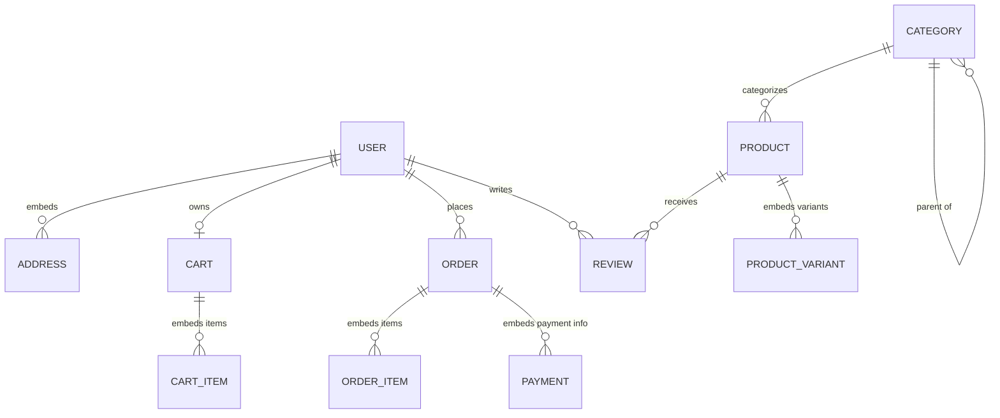

# Database Design & MongoDB Document Schemas

## 1. Database Architecture Overview
- **Database Engine**: MongoDB 7+ (Local via MongoDB Compass, Docker, or MongoDB Atlas)
- **ODM / Modeling**: Mongoose 9+ with `@nestjs/mongoose`
- **Primary Keys**: MongoDB `ObjectId` (`_id`), indexed automatically
- **Data Integrity**: Schema-level validation rules (`@Prop()`), compound indexes, strict typing, and multi-document transactions using Mongoose sessions where required.

---

## 2. Document Relationship Diagram



---

## 3. MongoDB Collection & Mongoose Schema Specifications

### 3.1 `users` Collection
```typescript
@Schema({ timestamps: true, collection: 'users' })
export class User {
  @Prop({ required: true, trim: true, maxlength: 120 })
  name: string;

  @Prop({ required: true, unique: true, lowercase: true, trim: true, index: true })
  email: string;

  @Prop({ required: true, select: false })
  passwordHash: string;

  @Prop({ required: true, enum: ['CUSTOMER', 'ADMIN'], default: 'CUSTOMER' })
  role: string;

  @Prop({ default: true })
  isActive: boolean;

  @Prop({ default: false })
  isEmailVerified: boolean;

  @Prop({ trim: true })
  phone?: string;

  @Prop()
  avatarUrl?: string;

  @Prop([AddressSchema])
  addresses: Address[];

  @Prop({ select: false })
  passwordResetToken?: string;

  @Prop({ select: false })
  passwordResetExpires?: Date;
}
```

### 3.2 `categories` Collection
```typescript
@Schema({ timestamps: true, collection: 'categories' })
export class Category {
  @Prop({ required: true, trim: true })
  name: string;

  @Prop({ required: true, unique: true, lowercase: true, trim: true, index: true })
  slug: string;

  @Prop({ trim: true })
  description?: string;

  @Prop({ type: Types.ObjectId, ref: 'Category', default: null, index: true })
  parentId?: Types.ObjectId;

  @Prop()
  imageUrl?: string;

  @Prop({ default: 0 })
  displayOrder: number;

  @Prop({ default: true })
  isActive: boolean;
}
```

### 3.3 `products` Collection
```typescript
@Schema({ timestamps: true, collection: 'products' })
export class Product {
  @Prop({ required: true, trim: true })
  title: string;

  @Prop({ required: true, unique: true, lowercase: true, trim: true, index: true })
  slug: string;

  @Prop({ required: true })
  description: string;

  @Prop({ type: Types.ObjectId, ref: 'Category', required: true, index: true })
  category: Types.ObjectId;

  @Prop({ required: true, min: 0 })
  price: number;

  @Prop({ min: 0 })
  comparePrice?: number;

  @Prop({ required: true, min: 0, default: 0 })
  stock: number;

  @Prop({ required: true, unique: true, uppercase: true })
  sku: string;

  @Prop([String])
  images: string[];

  @Prop([ProductVariantSchema])
  variants: ProductVariant[];

  @Prop({ default: 0, min: 0, max: 5 })
  ratingAvg: number;

  @Prop({ default: 0, min: 0 })
  reviewCount: number;

  @Prop({ default: true, index: true })
  isActive: boolean;
}

// Compound indexes for performant catalog queries:
// ProductSchema.index({ category: 1, price: 1 });
// ProductSchema.index({ title: 'text', description: 'text' });
```

### 3.4 `carts` Collection
```typescript
@Schema({ timestamps: true, collection: 'carts' })
export class Cart {
  @Prop({ type: Types.ObjectId, ref: 'User', unique: true, index: true })
  user: Types.ObjectId;

  @Prop([CartItemSchema])
  items: CartItem[];

  @Prop({ default: 0, min: 0 })
  subtotal: number;
}
```

### 3.5 `orders` Collection
```typescript
@Schema({ timestamps: true, collection: 'orders' })
export class Order {
  @Prop({ required: true, unique: true, index: true })
  orderNumber: string;

  @Prop({ type: Types.ObjectId, ref: 'User', required: true, index: true })
  customer: Types.ObjectId;

  @Prop([OrderItemSchema])
  items: OrderItem[];

  @Prop({ required: true, enum: ['PENDING', 'CONFIRMED', 'SHIPPED', 'DELIVERED', 'CANCELLED'], default: 'PENDING', index: true })
  orderStatus: string;

  @Prop({ required: true, min: 0 })
  subtotal: number;

  @Prop({ default: 0, min: 0 })
  discountTotal: number;

  @Prop({ required: true, min: 0 })
  shippingFee: number;

  @Prop({ required: true, min: 0 })
  grandTotal: number;

  @Prop({ type: ShippingAddressSchema, required: true })
  shippingAddress: ShippingAddress;

  @Prop({ type: PaymentInfoSchema, required: true })
  payment: PaymentInfo;
}
```

---

## 4. Local Development with MongoDB Compass
- MongoDB Compass connects directly to:
  `mongodb://127.0.0.1:27017`
- View database collections (`users`, `products`, `categories`, `orders`, `carts`, `coupons`).
- Inspect indexes, run aggregation queries, and verify sample seeded data visually.
