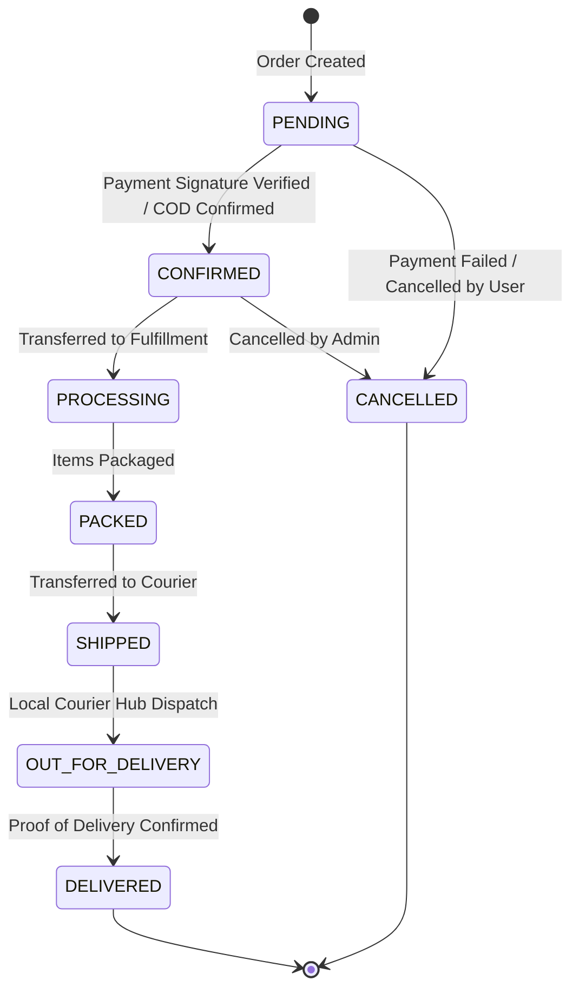

# E-Commerce Core Business Rules

## 1. Golden Rules of Commerce (Inviolable Principles)

1. **The Server is the Sole Arbiter of Money**:
   - The frontend never submits unit prices, discounts, subtotal, shipping fee, tax, or grand total.
   - The frontend submits only product IDs, variant IDs, quantities, address IDs, and coupon codes.
   - The NestJS backend loads product rows from PostgreSQL, evaluates verified prices, applies active discounts, and calculates the exact final sum.

2. **Immutable Historical Records**:
   - When an order is placed, an immutable snapshot of item prices, variant titles, product names, and shipping addresses is persisted in `order_items` and `orders`.
   - Subsequent price alterations or catalog edits in the `products` table MUST NEVER mutate historical order rows.

3. **Client Payment Status Cannot Be Trusted**:
   - Any client-side payment confirmation is treated as pending.
   - Transitions to `PAID` or `CONFIRMED` require verified server-side cryptographic signatures or webhook receipts from the payment gateway.

---

## 2. Inventory & Stock Rules in PostgreSQL

### 2.1 Concurrency & Pessimistic Row Locking
- During checkout, multiple concurrent buyers may attempt to purchase the same inventory.
- Stock checks and deductions MUST utilize PostgreSQL row-level locks within an explicit ACID transaction:
  ```sql
  SELECT * FROM products WHERE id = $1 FOR UPDATE;
  ```
- If `stock_quantity < requested_quantity`, abort and rollback immediately with `BadRequestException('Insufficient stock')`.

### 2.2 Inventory Mathematics
```
Available Stock to Sell = Total Stock Quantity - Reserved Stock Quantity
```

---

## 3. Order State Machine

Order state progression follows a strict non-cyclical lifecycle:



### 3.1 Cancellation Window
- **Customer**: Allowed to cancel ONLY if `order_status IN ('PENDING', 'CONFIRMED')`.
- Once an order reaches `PROCESSING` or `PACKED`, cancellation requires contacting customer support.

---

## 4. Promotional Coupon Mathematics

### 4.1 Validity Criteria
A coupon code is valid if and only if all of the following conditions pass:
1. `coupon.is_active = TRUE`
2. `CURRENT_TIMESTAMP >= coupon.start_date AND CURRENT_TIMESTAMP <= coupon.end_date`
3. `coupon.usage_limit IS NULL OR coupon.used_count < coupon.usage_limit`
4. `cart_subtotal >= coupon.min_order_amount`

### 4.2 Discount Calculations
- **Percentage Discount**:
  ```
  calculatedDiscount = (cart_subtotal * coupon.discount_value) / 100
  finalDiscount = coupon.max_discount_amount 
    ? Math.min(calculatedDiscount, coupon.max_discount_amount) 
    : calculatedDiscount
  ```
- **Fixed Discount**:
  ```
  finalDiscount = Math.min(coupon.discount_value, cart_subtotal)
  ```
- **Non-Negative Floor**: `grand_total = Math.max(0, subtotal - finalDiscount + shipping_fee + tax)`.

---

## 5. Review & Rating Eligibility

- Only customers who have completed an order with `order_status = 'DELIVERED'` containing the specified `product_id` can review that product.
- Enforced by a PostgreSQL unique constraint on `(product_id, user_id)`.
- Product `rating_avg` and `review_count` are recomputed via SQL aggregation whenever a review is posted or deleted.
