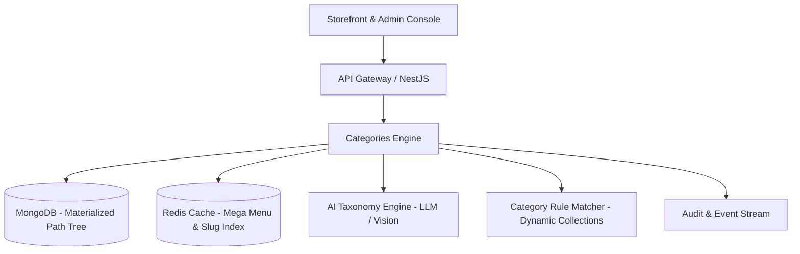
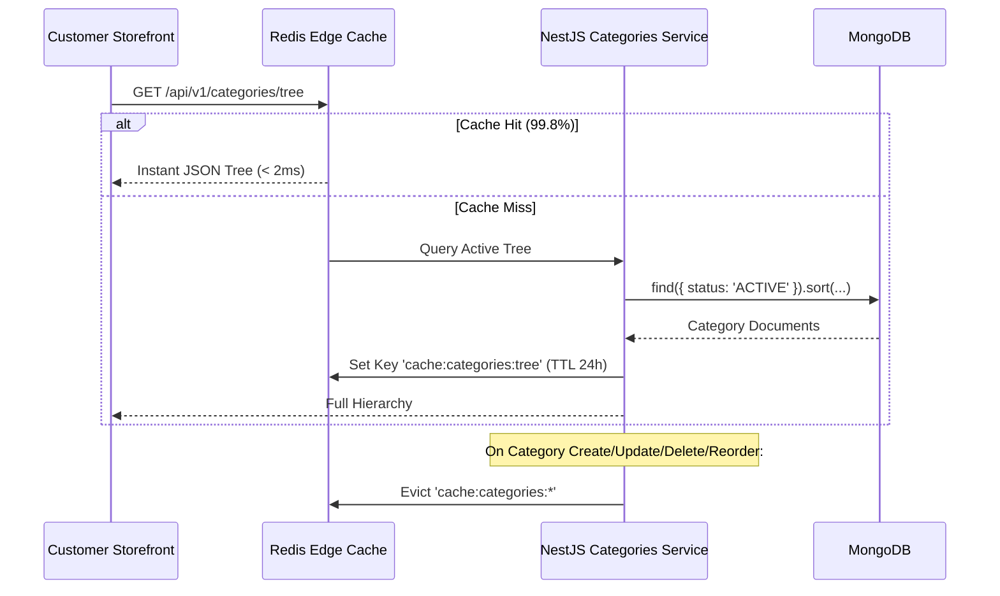

# 🚀 Advanced Category Management Module — Future Enhancement Roadmap

This document outlines the next-generation architecture and feature roadmap for the **ZYLO Category & Taxonomy Management Platform**, building upon the foundational materialized ancestor tree, custom UI controls, and multi-facet filtering engine.

---

## 🏗️ Architectural Overview & Core Capabilities



---

## 🎯 Phase 1: AI-Powered Taxonomy & Automated Tagging

| Capability | Technical Design | Business Value |
| :--- | :--- | :--- |
| **Auto-Classification** | Analyzes product title, description, and images using Gemini/LLM to recommend the optimal 3-level category path. | Saves 80% of catalog entry time for merchants with large catalogs. |
| **Smart Facet Discovery** | Scans product attributes in a category and automatically proposes relevant filter facets (e.g., discovering `refresh_rate` for Gaming Laptops). | Improves storefront navigation and conversion rates without manual merchant effort. |
| **Automated SEO Generator** | Generates click-optimized meta titles, rich descriptions, and Google Shopping Taxonomy (`google_product_category` ID). | Boosts organic search visibility and Google Shopping ad approvals. |

---

## ⚡ Phase 2: Dynamic Smart Collections (Rule-Based Categories)

Currently, categories hold manually assigned products. Dynamic Smart Collections allow categories to automatically populate based on rule conditions:

```json
{
  "isSmartCollection": true,
  "matchRules": {
    "condition": "ALL",
    "rules": [
      { "field": "tags", "operator": "contains", "value": "summer-sale" },
      { "field": "discountPercent", "operator": "greaterThan", "value": 25 },
      { "field": "inventoryQuantity", "operator": "greaterThan", "value": 0 }
    ]
  }
}
```

- **Real-Time Product Sync**: When inventory or price changes occur, products automatically enter or leave promotional categories.
- **Scheduled Merchandising Badges**: Set time-decay promotional badges (e.g. `FLASH SALE` badge auto-expires on Sunday 11:59 PM).

---

## 🌲 Phase 3: Drag-and-Drop Tree Reordering & Enterprise Virtualization

1. **Fluid Canvas Drag-and-Drop**:
   - Implement `@dnd-kit/core` with custom tree sorting sensors.
   - Interactive visual drop indicators: Drop inside (re-parent), Drop above (re-order before), Drop below (re-order after).
   - Real-time cycle interception during drag drag-over (prevents dropping a parent into its own branch).
2. **Virtualized Large-Tree Rendering**:
   - Using `@tanstack/react-virtual` for enterprise catalogs managing 1,000+ categories with zero DOM lag.
3. **Keyboard Accessibility**:
   - Keyboard tree traversal and re-ordering (`Alt + Arrow Keys` to shift order or indent/outdent level).

---

## 🌐 Phase 4: High-Performance Redis Edge Caching & Headless CDN

Storefront navigation menus are accessed on every page visit. Minimizing database overhead is paramount:



---

## 🌍 Phase 5: Multi-Language Localization & RTL Storefront Support

- **Multi-Locale Schema**:
  ```typescript
  locales: {
    es: { name: "Portátiles", description: "...", metaTitle: "..." },
    fr: { name: "Ordinateurs Portables", description: "...", metaTitle: "..." },
    ar: { name: "أجهزة الكمبيوتر المحمولة", description: "...", metaTitle: "..." }
  }
  ```
- **Slug Aliasing**: Dedicated localized URL routes (e.g., `/es/categorias/portatiles` maps to same MongoDB document).
- **RTL Direction Support**: Automatic right-to-left layout for Arabic and Hebrew locales.

---

## 📊 Phase 6: Category Intelligence & Revenue Velocity

1. **Category Performance Dashboard**:
   - Gross Merchandise Value (GMV) per taxonomy branch.
   - Conversion rate by category level (Root vs Subcategory).
   - Average Order Value (AOV) and return rate distribution.
2. **Zero-Result Search Insights**:
   - Logs customer search queries that returned 0 results.
   - Recommends creating new categories or synonyms (e.g., "30 users searched for 'MacBook Air' with 0 hits — create subcategory or tag").

---

## 📅 Suggested Implementation Phases

| Milestone | Target Horizon | Priority | Key Deliverables |
| :--- | :--- | :--- | :--- |
| **M1: Dynamic Collections & Badges** | Next Sprint | High | Smart rule matching engine, scheduled badges |
| **M2: Drag & Drop Tree Canvas** | Sprint +1 | High | Dnd-kit tree drag-and-drop, batch reorder API |
| **M3: Redis Mega-Menu Edge Cache** | Sprint +2 | High | Sub-millisecond response time, automatic invalidation |
| **M4: AI Taxonomy & Auto-SEO** | Sprint +3 | Medium | Gemini product classifier, facet recommendation |
| **M5: Multi-Language Taxonomy** | Sprint +4 | Medium | Localization schema, localized slug routes |
