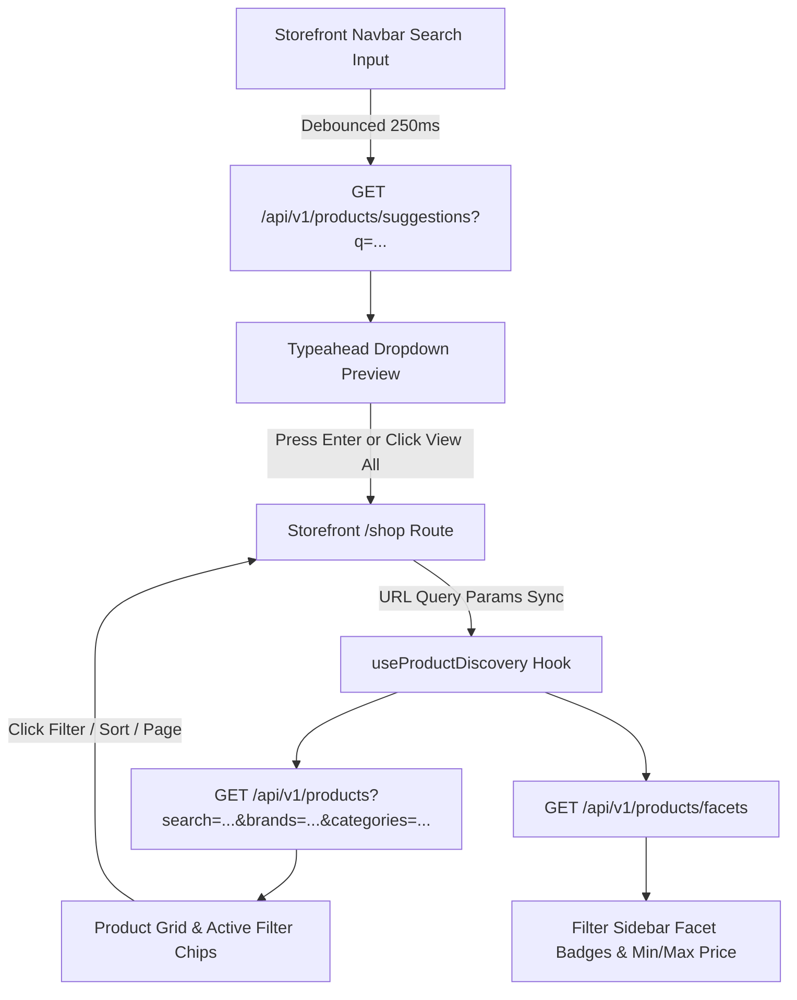

# Module 5: Customer Product Discovery, Search & Filtering Plan

> **Scope**: Storefront Customer Product Search, Multi-Faceted Filtering, Category & Brand Browsing, Debounced Typeahead Suggestions, Dynamic Facets, and Server-Side Pagination.  
> **Status**: Planning & Architecture Review  
> **Owner**: Full-Stack Architecture  

---

## 1. Executive Summary & Goals

Module 5 equips the **ZYLO Storefront** (`apps/storefront`) with an enterprise-grade, high-conversion product discovery engine. Customers can quickly discover items among our 36+ seeded catalog products across 35 categories and 25 global brands through:
1. **Omni-Channel Keyword Search & Instant Typeahead Autocomplete**: Real-time debounced suggestion dropdown in the main header navbar.
2. **Multi-Faceted Filter Sidebar**:
   - Hierarchical category selection with product counts.
   - Brand partner multi-select with search.
   - Dual-handle price range slider with manual inputs.
   - In-stock availability toggle.
   - Customer star rating filters (4★ & above, 3★ & above).
3. **Smart Sorting & Pagination**:
   - Sort by: Newest Arrivals, Price: Low to High, Price: High to Low, Top Rated, and Best Sellers.
   - Clean server-side pagination with dynamic page sizing.
4. **Active Filter Chips & State Management**:
   - Synced bi-directionally with browser URL search params (`?search=...&category=...&brand=...&minPrice=...&maxPrice=...&inStock=true`).
   - One-click individual chip removal and "Clear All" button.
5. **High-Fidelity Storefront Product Grid & Card**:
   - Uniform `rounded-md`, `shadow-none`, rich badges (Sale percentage discount, New Arrival, Featured spotlight).
   - Secondary image hover transition.
   - Star rating preview.
   - Responsive Mobile Drawer for filters on phones and tablets.

---

## 2. Technical Architecture & Data Flow



---

## 3. Backend Enhancements (`server/src/modules/products/`)

### 3.1 DTO & Query Parameters (`query-product.dto.ts`)
- Support multi-category filtering (`categoryIds?: string[]` or comma-separated).
- Support multi-brand filtering (`brandIds?: string[]` or comma-separated).
- Support minimum rating filter (`minRating?: number`).
- Support price range (`minPrice?: number`, `maxPrice?: number`).
- Support stock availability (`inStockOnly?: boolean`).
- Ensure case-insensitive keyword regex across `name`, `description`, `shortDescription`, `sku`, and `tags`.

### 3.2 Dynamic Facets Aggregation Endpoint (`GET /api/v1/products/facets`)
Returns dynamic facet distribution to prevent dead-end filtering:
```json
{
  "categories": [
    { "_id": "...", "name": "Headphones", "count": 6 }
  ],
  "brands": [
    { "_id": "...", "name": "Sony", "count": 4 }
  ],
  "priceRange": {
    "min": 19.99,
    "max": 1850.00
  },
  "totalAvailable": 36
}
```

### 3.3 Typeahead Suggestions Endpoint (`GET /api/v1/products/suggestions?q=...`)
Returns lightweight top 5 matching items with title, thumbnail, price, slug, and category for instant search previews.

---

## 4. Shared Library Enhancements (`packages/shared/`)

1. **Types (`packages/shared/src/types/product.ts`)**:
   - `ProductFacets`: categories, brands, priceRange, total.
   - `SearchSuggestion`: id, name, slug, thumbnailUrl, price, categoryName.
   - Expanded `QueryProductParams`: `categoryIds`, `brandIds`, `minRating`, `inStockOnly`.
2. **API Client (`packages/shared/src/api/products.service.ts`)**:
   - `getFacets(params?: QueryProductParams)`
   - `getSuggestions(query: string)`
3. **Reusable UI Components (`packages/shared/src/ui/`)**:
   - `PriceRangeSlider`: Dual-slider component for budget boundaries.
   - `RatingStars`: Accessible SVG star rating display.

---

## 5. Storefront Frontend Implementation (`apps/storefront/`)

### 5.1 Real-Time Navbar Autocomplete (`CustomerNavbar.tsx`)
- Attach input state to debounced suggestion hook.
- Render dropdown under search bar with:
  - Product thumbnail, bold title, category chip, and price.
  - "See all X results" keyboard-navigable footer link.
  - Category filter dropdown sync (e.g. search within "Electronics" only).

### 5.2 Shop & Catalog Browse Page (`ShopPage.tsx` under `/shop`)
- Update `AppRoutes.tsx`: replace `ComingSoonPage` for `ROUTES.CUSTOMER.SHOP` with `ShopPage`.
- Structure:
  - **Breadcrumbs & Page Header**: Dynamic category/brand title and count.
  - **Toolbar**:
    - Mobile Filter Trigger button (`Filter (3)`).
    - Results counter (`Showing 1–12 of 36 products`).
    - Sort selector dropdown (`Newest`, `Price: Low to High`, `Price: High to Low`, `Rating`).
    - Grid / List view mode toggle.
  - **Active Filter Chips**: Pills for active search term, selected brands, price bracket, and ratings with individual `×` dismiss and "Clear All" button.
  - **Desktop Sidebar**:
    - Category Tree Facet (Root departments with collapsible child subcategories).
    - Brand Partner Facet (Searchable checkbox list with SKU count badges).
    - Price Filter (Slider + `$Min` and `$Max` inputs + Apply button).
    - Availability ("In Stock Only" toggle).
    - Rating Filter (4★ & above, 3★ & above).
  - **Product Grid**:
    - Responsive 2-column (mobile), 3-column (tablet), 4-column (desktop).
    - `ProductCard` with high-resolution Unsplash image, discount percentage pill, brand label, price, and Add to Cart / Details button.
  - **Pagination**:
    - Accessible page numbers, Prev/Next buttons, and direct page jumps.
  - **Mobile Filter Drawer**:
    - Slides out from left on small screens with fixed "Apply Filters" footer button.

---

## 6. Verification & Acceptance Criteria

1. **Search**: Typing "Sony" in the navbar displays immediate suggestions; pressing Enter redirects to `/shop?search=Sony` with filtered results.
2. **Category Navigation**: Clicking a category filters the catalog by that category and updates active chips.
3. **Brand Facets**: Selecting multiple brands (e.g., Apple + Sony) displays items belonging to either brand.
4. **Price Filter**: Setting max price to $300 hides products over $300.
5. **Stock Toggle**: Toggling "In Stock" excludes out-of-stock items.
6. **URL State Synchronization**: Refreshing the browser or sharing the URL preserves all active filters and sort orders.
7. **Design Consistency**: Strict `shadow-none`, uniform `rounded-md`, clean contrast, and zero layout shift.
